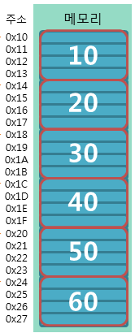

### 1-1.Array는 어떤 자료구조인가요?

Array는 연관된 data를 모아서 메모리상에 연속적이며 **순차적으로 저장**하는 자료구조 입니다.

**고정된 저장 공간**을 가진다는 점과 **순차적으로 데이터를 저장**한다는 것이 특징입니다.

**배열은 어떻게 사용하고 어떻게 저장될까요?**

`int array[6] = {10, 20, 30, 40, 50, 60};` 라고 배열을 만들면

오른쪽 이미지와 같이 연속적으로 데이터가 저장되게 됩니다.

**배열의 시간 복잡도**

- 조회 `O(n)`

  2번 인덱스에 어떤 값이 있는지 조회할 때 컴퓨터는 첫번째의 인덱스(배열의 이름)에 이동하는 위치 * 4바이트를 더해주면 바로 주소를 알 수 있다. (Random Access 라고 한다.)

  `0번인덱스의 주소 + (인덱스 2 * 4바이트 = 8바이트) → 2번 인덱스의 메모리 주소`

- 마지막 인덱스에 추가 `O(1)`, 마지막 인덱스에 삭제 `O(1)`
- 삽입 `O(n)`, 삭제 `O(n)`, 탐색 `O(n)`

  연속적으로 데이터가 저장되어있기 때문에, 중간에 삭제하는 경우에는 N번 땡겨줘야하고, 중간에 추가하려면 N번 늘려주어야한다.

**Array의 장점**

- 조회가 빠르다. 따라서 조회를 자주 해야되는 작업에서는 좋다.

**Array의 단점**

- fixed-size 특성때문에 크기를 미리 지정 정해야 하기 때문에, 메모리 낭비나 overhead가 발생할 수 있다.

### 1-1(꼬꼬무).미리 예상한 것보다 더 많은 수의 Data를 저장하느라 Array의 Size를 넘어서게 됐습니다. 이 때, 어떻게 해결할 수 있을까요?

기존의 Size보다 더 큰 Array를 선언하여 데이터를 옮겨 할당합니다. 모든 데이터를 옮겼다면 기준 Array는 메모리에서 삭제하면 됩니다.

이렇게 동적으로 배열의 크기를 조절하는 자료구조를 Dynamic Array라고 합니다.

또 다른 방법으로는, Size를 예측하기 쉽지 않다면 Array 대신 Linked List를 사용함으로써 데이터가 추가될 때마다 메모리 공간을 할당받는 방식을 사용하면 됩니다.